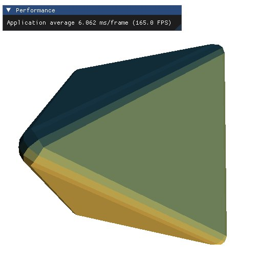

# Slang2WebGPU

## Build
Clone this repo with all its submodules:

  * git clone https://github.com/sadsergo/slang2webgpu.git
  * git submodule update --init --recursive

### Install packages

  * sudo apt install -y cmake build-essential libxrandr-dev libxinerama-dev
  * sudo apt install -y libxcursor-dev mesa-common-dev libx11-xcb-dev pkg-config nodejs npm
  * sudo apt-get install -y libglfw3 libglfw3-dev
  * install Slang binaries: https://github.com/shader-slang/slang/releases/tag/v2025.10.2
  * install WebGPU Native binaries: https://github.com/gfx-rs/wgpu-native/releases/tag/v25.0.2.1
  * Move binaries into external folder as external/slang/files

### Linux and Windows

  * cmake -S . -B build -DCMAKE_BUILD_TYPE=Release
  * cmake --build build -j16
## Examples
### Pyramid

